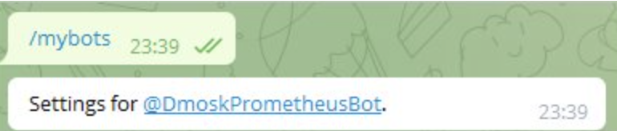

# Setup a running validator node for shardnet on GCP with telegram alert

### PART I - create resources

This instruction decribdes a process setuption of NEAR Validator node on GCP

first of all you need: 
- Account on Google Cloud Platform https://cloud.google.com/ - *you might create new account with free billing periods*
- install gcloud on your work machine - choose ypur OS platform on this page https://cloud.google.com/sdk/docs/install and install gcloud 
- and Telegram account 

You should create a private VPS network, with firewall rules for ssh and validator connect 
And create instansce n2-standart-4 with 500 Gb SSD and connect your new priate network and add firewall rules

This instance coast about 210$ per month 

#### If you use Google Cloud Console a first time, pleace follow this my [instruction](GCP-setting.md)

### PART II - Setup node 

Connect through ssh on your instance 

Update and Upgrade system: 

    sudo apt update && sudo apt upgrade -y

Install developer tools:

    sudo apt install -y git binutils-dev libcurl4-openssl-dev zlib1g-dev libdw-dev libiberty-dev cmake gcc g++ python docker.io protobuf-compiler libssl-dev pkg-config clang llvm cargo -y

Install python3 
    sudo apt install python3-pip

And set configuration 

    USER_BASE_BIN=$(python3 -m site --user-base)/bin
    export PATH="$USER_BASE_BIN:$PATH"

Install Building env

    sudo apt install clang build-essential make

Next, install Rust and Cargo 

    curl --proto '=https' --tlsv1.2 -sSf https://sh.rustup.rs | sh
    source $HOME/.cargo/env

Next you must install `Node.js` and `NPM` package manager
    
    curl -sL https://deb.nodesource.com/setup_18.x | sudo -E bash -  
    sudo apt install build-essential nodejs -y
    PATH="$PATH"

Check versions 

    node -v
    npm -v

You must have Node's version 18.6.0 and NPM's version 8.13.2 or above

Our next step it is install Near-CLI

    sudo npm install -g near-cli

I recommend to you read [Official Near Cli documentation](https://docs.near.org/docs/tools/near-cli) it is very important instrument

if you did evrithing right, you show this 

#### Connect to shardnet 

Connect to shardnet 

    export NEAR_ENV=shardnet

I recommend run this command to set the Near testnet Environment persistent

    echo 'export NEAR_ENV=shardnet' >> ~/.bashrc

Check this 
    near proposals

#### Install nearcore 

Clone the nearcore repository 

    git clone https://github.com/near/nearcore
    cd nearcore
    git fetch

Checkout to the branch needed. Please check the releases page on GitHub.

    git checkout <version>

Compile nearcore 

    cargo build -p neard --release --features shardnet

#### Initialize working directory

Generate the initial required working directory by running:

    ./target/release/neard --home ~/.near init --chain-id shardnet --download-genesis

Replace the config.json

    rm ~/.near/config.json
    wget -O ~/.near/config.json https://s3-us-west-1.amazonaws.com/build.nearprotocol.com/nearcore-deploy/shardnet/config.json

#### Get latest snapshot 
##### !!!! if you connect after 18 july 2022 skip this step 
Install AWS Cli

    sudo apt-get install awscli -y

Download last snapshot

    cd ~/.near
    aws s3 --no-sign-request cp s3://build.openshards.io/stakewars/shardnet_noarchive/data.tar.gz .  
    tar -xzvf data.tar.gz

If the above fails, AWS CLI may be oudated in your distribution repository. Instead, try:

    pip3 install awscli --upgrade

#### Run the node

To start your node simply run the following command:

    cd nearcore
    ./target/release/neard --home ~/.near run

### PART III - Setup node as validator

First of all you must create a wallet on [shardnet](https://wallet.shardnet.near.org)  

you must remember you seed phrases (consist 12 words)

Also you get about 2000 tokens *this token not real*

#### Connect your wallet on near-cli 

    near login

Open link on your browser and grant Access to Near CLI

#### Check the validator_key.json

     cat ~/.near/validator_key.json

Note: If a validator_key.json is not present, follow these steps to create one

#### Create a validator_key.json

* Generate the Key file:
    
    near generate-key <pool_id> 

<pool_id> ---> xx.factory.shardnet.near WHERE xx is you pool name

Next, copy this file in shardnet folder, and chamge name on ypur account id

    cp ~/.near-credentials/shardnet/YOUR_WALLET.json ~/.near/validator_key.json

also you must correct validator_key.json, edit "account.id" ---> <name_your_pool>.factory.shardnet.near
and change "private_key" on "secret_key"

If you did all right, json key will be loock same 

`{
  "account_id": "xx.factory.shardnet.near",
  "public_key": "ed25519:HeaBJ3xLgvZacQWmEctTeUqyfSU4SDEnEwckWxd92W2G",
  "secret_key": "ed25519:****"
}`

The next step you must start validator node:

    target/release/neard run

#### Create NEAR system service

If we wont that our node work under screen and have autostart and logs, we need create near system service

First, create system file 

    sudo vi /etc/systemd/system/neard.service

Paste this parametrs and chande <USER> on your name and name home directory, for example - root 

    [Unit]
    Description=NEARd Daemon Service

    [Service]
    Type=simple
    User=<USER>
    #Group=near
    WorkingDirectory=/home/<USER>/.near
    ExecStart=/home/<USER>/nearcore/target/release/neard run
    Restart=on-failure
    RestartSec=30
    KillSignal=SIGINT
    TimeoutStopSec=45
    KillMode=mixed

    [Install]
    WantedBy=multi-user.target

Next enable this service 

    sudo systemctl enable neard

And start 

    sudo systemctl start neard

Check status 

    sudo systemctl status neard

if you want stop service run it 

    sudo systemctl stop neard

Also if you edited other parameters your node to restart service

    sudo systemctl restart neard

Watch logs 

    journalctl -n 100 -f -u neard

If you want a color logs, install `ccze`

    sudo apt install ccze

And view a color logs

    journalctl -n 100 -f -u neard | ccze -A

### PART IV - Create and control POOL

#### Deploy a Staking Pool Contract

    near call factory.shardnet.near create_staking_pool '{"staking_pool_id": "<pool id>", "owner_id": "<accountId>", "stake_public_key": "<public key>", "reward_fee_fraction": {"numerator": 5, "denominator": 100}, "code_hash":"DD428g9eqLL8fWUxv8QSpVFzyHi1Qd16P8ephYCTmMSZ"}' --accountId="<accountId>" --amount=30 --gas=300000000000000

<pool_id> - name your pool (without net indeficators) example `"staking_pool_id": "simple_pool"`
<accountId> - your account ID - `bob.shardnet.near`
<public key> - publick key from your credential's file `~/.near-credentials/shardnet/account_name.json`

#### If ypu want change parametrs use this command 
  
    near call <pool_name> update_reward_fee_fraction '{"reward_fee_fraction": {"numerator": 1, "denominator": 100}}' --accountId <account_id> --gas=300000000000000

#### You have now configure your Staking pool.

[Check your pool is now visible on](https://explorer.shardnet.near.org/nodes/validators)

#### Ping

A ping issues a new proposal and updates the staking balances for your delegators. A ping should be issued each epoch to keep reported rewards current.

Do this command

    near call <staking_pool_id> ping '{}' --accountId <accountId> --gas=300000000000000

#### Auto ping 

You must send ping epoch, one time on 2,5 - 3 hours
I get you auto ping script 

Create file on your home direction 

nano ping.sh 

paste this script 

    #!/bin/sh
    # Ping call to renew Proposal added to crontab

    export NEAR_ENV=shardnet
    export LOGS=/home/<USER>/logs
    export POOLID=<yourID>
    export ACCOUNTID=<yourPOOL>

    echo "---" >> $LOGS/all.log
    date >> $LOGS/all.log
    near call $POOLID.factory.shardnet.near ping '{}' --accountId $ACCOUNTID.shardnet.near --gas=300000000000000 >> $LOGS/all.log
    near proposals | grep $POOLID >> $LOGS/all.log
    near validators current | grep $POOLID >> $LOGS/all.log
    near validators next | grep $POOLID >> $LOGS/all.log

change 
*<USER> - name home direction
*<yourID> - name you account without network name - example `bob`
*<yourPOOL> - name your pool withour netwokr name - example `simple_pool`

Press Ctr+O and 'y' next press Ctr+X ---> safe file 

Create logs direction 

    mkdir ~/logs

next we must change file permission, do next command 

    chmod +x ~/ping.sh 

test the script 
  
    ./ping.sh

if you haven't erorrs add this script to crontab 

    crontab -e 

 past in the end sctring `*/5 * * * *  /home/<USER>/ping.sh` and save 

 Ok, next please reboot neard with help systemctl *remember our last lesson* and you node ready! 

 ### PART V - Setup Monitoring Services 

In this part we setup [Prometheus](https://prometheus.io/) [Grafana](https://prometheus.io/) and [Alertmanager](https://prometheus.io/docs/alerting/latest/alertmanager/) on Docker containers! Are you ready?  

First of all we must create new instance on GCP, because if we deploy this services on near validator instance we don't get alerts when instance shutdown or has other troubles (network disconnect)

Please follow this [instruction](GCP-Prometheus-instance.md)

Coonect through SSH to our monitoring instance 

    gcloud compute ssh --zone "<your time zone>" "near-monitoring"  --project "<id your project>"

And install Docker on [official documentation](https://docs.docker.com/engine/install/ubuntu/)
next install docker-compouse *i prefe [documentation of Digitial Ocean](https://www.digitalocean.com/community/tutorials/how-to-install-and-use-docker-compose-on-ubuntu-20-04)*

okey next step we must create docker containers with our service 

create directory 

    sudo mkdir -p /opt/prometheus_stack/{prometheus,grafana,alertmanager}

create file 

    sudo touch /opt/prometheus_stack/docker-compose.yml

go to the prometheus direction 

    cd /opt/prometheus_stack

open docker-compose file and past this [file](monitoring/docker-compose.yml)

   sudo vi docker-compose.yml

#### Prometheus and Grafana

Create prometheus config file

    sudo vi prometheus/prometheus.yml

copy and past this [setting](monitoring/prometheus/prometheus.yml)

deploy our containers 

    docker-compose up -d

and check --> http://ip_addr_near_minitoring:3000

User and password `admin/admin` please set up another 

Setup Prometheus connect on Grafana

**Configuration - Data Sources** 

**Add data source:**

Among the list of data sources, we find and select Prometheus by clicking on **Select:**

Set the parameters for connecting to Prometheus:

click **save & test**

Add dashbords to monitoring local-node-exporter

Click on the plus image and select **Import:**

Enter the dashboard ID. For Node Exporter it is 1860:

open dashbord

#### create telegram bot 

find id bot - `@my_id_bot`

create a new bot, find botFather `@BotFather`

start tgis bot and create new bot this command 

    /newbot 

get username our bot 

    /mybots

Connect our bot to alertmanager, but first create alert [rules file](monitoring/prometheus/alert.rules)

    sudo vi prometheus/alert.rules

Go to alertmanager config 

    sudo vi alertmanager/config.yml

and past this 

    route:
    receiver: 'telegram'

    receivers:
    - name: 'telegram'  
    telegram_configs:
    - bot_token: "<bot tocken>"
        send_resolved: true
        api_url: "https://api.telegram.org"
        chat_id: <you chat id>
        parse_mode: "Markdown"    

full your bit tiken and chat id and save

Down docker compose 

    sudo docker-compose down

And Up with new configuraion 

    sudo docker-compose up -d 

#### Install node and near exporter on Validator 

Connect your validator instance and install prometheus node exporter 

    sudo apt install prometheus-node-exporter -y 

Next, install [Docker](https://docs.docker.com/engine/install/ubuntu/)
And build this container 

    sudo docker run -dit \
        --restart always \
        --name near-exporter \
        --network=host \
        -p 9333:9333 \
        masknetgoal634/near-prometheus-exporter:latest /dist/main -accountId <YOUR_POOL_ID>

check metrics 

    curl localhost:9333/metrics

if you did all right you show same 

disconect on this instance and connect to near monitoring 

change host-file 

    sudo vi /etc/hosts

and add string `<local_ip> producer`

<local_ip> - local ip near_validator 

and rebuild docker-compose 

    cd /opt/prometheus_stack
    docker-compose down
    docker-compose up -d

### Done, next update I will add new rules and new exporters 
